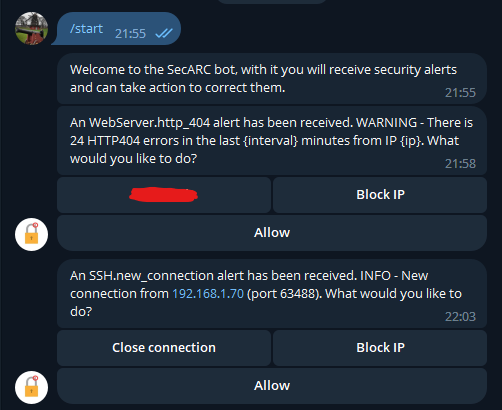
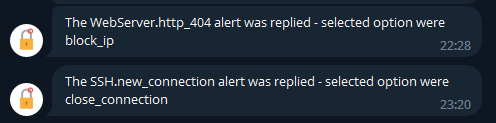
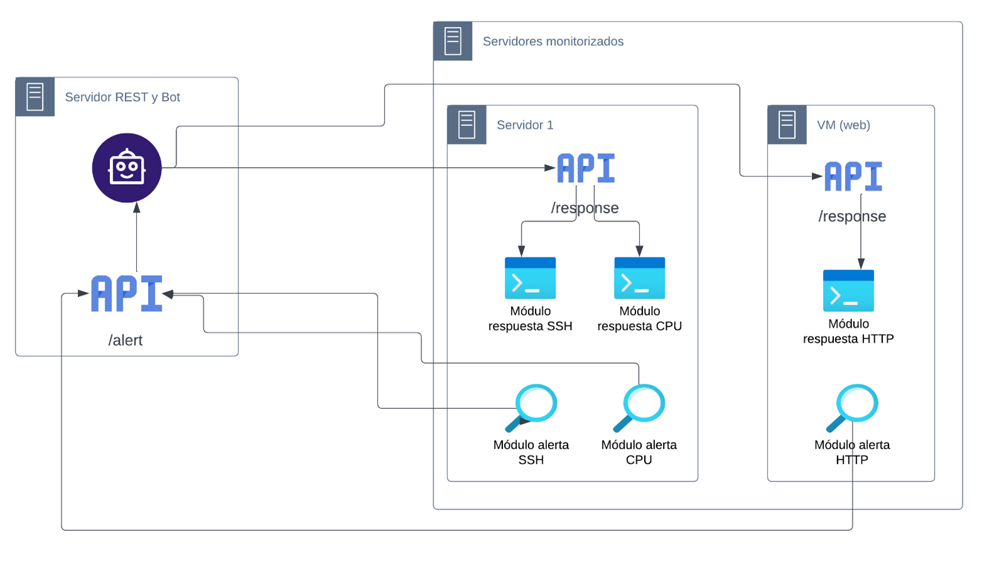

# 20-21_jaquba - SecARC (Security Alerts and Remote Control)

[](https://www.python.org/downloads/)
[](https://choosealicense.com/licenses/mit/)

## Indice 
> 1. [Descripción del proyecto](#descripción-del-proyecto)
> 2. [Características](#características)
> 3. [Pre-requisitos](#pre-requisitos)
> 4. [Instalación](#instalación)
> 5. [Configuración](#configuración)
> 6. [Ejecución y uso](#ejecución-y-uso)
> 7. [Arquitectura](#arquitectura)

# Descripción del proyecto

SecARC es una herramienta de detección y respuesta a incidentes de seguridad detectados en servidores Linux.
Actualmente permite, aunque es facilmente ampliable, las siguientes funcionalidades:

- Detectar nuevas conexiones SSH contra un servidor y responder a ellas de tres maneras:
    * Permitiendo la conexión.
    * Cerrando la conexión, pero permitiendo otras nuevas.
    * Bloqueando la IP, de modo que se rechacen todas las conexiones (incluyendo la actual).
- Monitorizar el uso de CPU de un servidor y generar una alerta cuando supere un umbral predefinido.
Ignora los picos de utilización, para evitar producir demasiadas alertas, y comprueba un uso de recursos sostenido.
Ofrece tres posibles respuestas:
    * No actuar, con lo que se permite dicho uso hasta la proxima alerta generada.
    * Reiniciar el servidor.
    * Apagar el servidor.
- Monitorizar las peticiones HTTP a un servidor web y generar una alerta cuando el número de errores 404 procedentes de una misma dirección IP, en un intervalo definido, supere el umbral indicado.
Esto puede indicar que se está produciendo un ataque de escaneo de recursos o de denegación de servicio.
Como respuesta solo ofrece dos posibilidades:
    * No actuar, permitiendo las conexiones hasta la próxima alerta.
    * Bloquear la IP, de modo que no pueda hacer más peticiones.
- Recibir las alertas y poder responder a ellas de manera rápida y sencilla, mediante la aplicacion de mensajería Telegram, con solo pulsar un botón.
Esto es beneficioso ante una amenaza, ya que reduce mucho el tiempo de respuesta, con lo que se minimiza el posible daño ocasionado.

Las ventajas de esta herramienta frente a otras disponibles en el mercado son:
- Facilidad de instalación, configuración y ampliación.
- De bajo coste y sin requerir hardware adicional.
- Control de las alertas y las respuestas sencillo y rápido.

# Características 

[](https://code.visualstudio.com/)

Como entorno de desarollo se ha utilizado Visual Studio Code, ya que nos ofrece una serie de plugins que nos facilitan el desarrollo y las pruebas.

[](https://www.python.org/)

Como lenguaje principal para el desarrollo del proyecto se ha usado Python, concretamente la versión 3.11 por ser la última disponible en este momento.

[](https://telegram.org/)

Se ha utilizado Telegram como panel de control donde visualizar y responder las alertas recibidas, mediante el bot que se ha desarrollado.\
Para crear el bot se ha utilizado BotFather y la libreria [python-telegram-bot](https://github.com/python-telegram-bot/python-telegram-bot).

[](https://fastapi.tiangolo.com/)

Se utiliza FastAPI para crear los endpoints de cada una de las API necesarias:
- /alert: Se ubica en la misma máquina que el bot y permite recibir las alertas
- /response: Ubicado en cada servidor a monitorizar para recibir las respuestas

El servidor utilizado para ejecutar las APIs ha sido [Uvicorn](https://www.uvicorn.org/) ya que es ligero, rápido y se integra perfectamente con FastAPI y Python.

[](https://nginx.org/en/)

Utilizamos Nginx como servidor HTTP para simular una página web que esta recibiendo tráfico real y poder monitorizar los errores HTTP 404 que ocurren por cada IP cliente, de modo que se compruebe el funcionamiento del módulo de detección correspondiente.

# Pre-requisitos

- El bot se debe instalar en una máquina con acceso a Internet, para que pueda comunicarse con Telegram para enviar las alertas al usuario y recibir las respuestas elegidas por este.
- Los servidores a monitorizar tienen que tener conectividad de red con la máquina que ejecuta el bot, para poder enviar las alertas detectadas.
- La máquina que ejecuta el bot también debe tener conectividad con los servidores a monitorizar, para poder enviar las respuestas.
- Tener instalado Python 3, tanto en los servidores a monitorizar, como en la máquina que ejecutará el bot.
- [Solo para monitorizar errores HTTP 404] Tener instalado y correctamente configurado el servidor web Nginx.
Se puede seguir la siguiente [guia de instalación](https://linuxhint.com/install-nginx-linux-mint/), solo aplicable para Ubuntu y Linux Mint, revisar para otras distribuciones Linux.
- Tener el Token del bot a utilizar. Para ello se utiliza @BotFather, un bot que proporciona Telegram para configurar nuevos bots. Para crearlo, se puede seguir la siguiente [guia](https://atareao.es/tutorial/crea-tu-propio-bot-para-telegram/).

# Instalación

1. Clonar el repositorio en la ruta deseada:
   
```bash
git clone https://github.com/MCYP-UniversidadReyJuanCarlos/20-21_jaquba.git
```

2. Configurar los módulos de alerta para que apunten a la IP de la máquina en la que se ejecutará el bot y la API /alert.
Esto es necesario para que podamos enviar las alertas al bot.
Para ello editamos el fichero alert/config.ini y cambiamos la variable "ip" que vemos en la sección BOT (linea 7) por la que corresponda. 
6. Configurar el Token del bot que queremos usar. Para ello abrimos el fichero bot/config.ini y sustituimos {Bot Token} por el token correcto.
4. Copiar las carpetas necesarias en cada máquina, en la ruta deseada:
    * En la máquina que ejecutará el bot y la API  /alert: solo es necesaria la carpeta bot
    * Para los servidores a monitorizar: se deben copiar las carpetas alert y response

5. Eliminar los módulos que no sean necesarios para cada servidor. Tener en cuenta que se debe eliminar tanto el módulo de detección (de la carpeta alert) como el de respuesta (carpeta response).
Por ejemplo, si queremos eliminar el módulo HTTP debemos:
    * Entrar en la carpeta alert y borrar el fichero web_server.py
    * Editar el fichero config.ini y eliminar las variables relacionadas: interval_HTTP, threshold_warning_HTTP y threshold_critical_HTTP
    * Entrar en la carpeta response y borrar el fichero web_server.py
    * Editar el fichero response.py para eliminar las referencias a dicho módulo del método get_response

6. Instalar las dependencias necesarias, para ello entraremos en cada una de las carpetas (bot, alert y response) y ejecutaremos el siguiente comando:
```bash
pip install -r requirements.txt
```

7. [OPCIONAL] En los servidores a monitorizar, pero especialmente en los que instalemos el módulo de uso de CPU (PerfMonitor) debemos hacer un paso adicional para evitar tener que lanzar manualmente los módulos de detección y respuesta tras un reinicio.
Vamos a configurar un job de cron que relance dichos módulos tras reiniciar el equipo.
    * Lanzamos el siguiente comando, que nos permite editar el fichero crontab, que posteriormente será leido por cron.

        ```bash
        crontab -e
        ```

    * La primera vez nos pedirá seleccionar el editor a utilizar, escogemos nano, por ejemplo.
    Una vez en el editor pegamos las siguientes lineas, tendremos que adaptarlas en función de la ubicación en la que hayamos copiado las carpetas alert y response.
    Notar el sleep en el primer @reboot, es necesario para que tengamos disponible la interfaz de red y podamos obtener correctamente la IP local, además de evitar generar alertas que no puedan ser respondidas.

        ```
        @reboot /usr/bin/sleep 10;/usr/bin/python3 -u /home/javier/Desktop/20-21_jaquba/alert/alert.py > /home/javier/Desktop/20-21_jaquba/logs/alert.log 2>&1
        @reboot /usr/bin/python3 -u /home/javier/Desktop/20-21_jaquba/response/response.py > /home/javier/Desktop/20-21_jaquba/logs/response.log 2>&1
        ```
    * Crearemos la carpeta y ficheros necesarios para registrar los logs que escriben cada uno de los módulos. Para ello se ejecutan los siguientes comandos:

        ```bash
        mkdir ~/Desktop/20-21_jaquba/logs
        cd ~/Desktop/20-21_jaquba/logs
        touch alert.log
        touch response.log
        ```

# Configuración

Podemos personalizar el comportamiento de la herramienta si es necesario.

Se puede elegir el idioma del bot entre Español e Inglés, o definir un nuevo idioma.
Para cambiar el idioma tendriamos que editar el fichero bot/main.py y poner el código de idioma elegido en la variable default_locale: 'es' para Español o 'en' para Inglés.
Si queremos otro idioma tenemos que seguir los siguientes pasos:

1. Crear un nuevo fichero dentro de la carpeta bot/translations, copiando uno de los existentes y renombrandolo como "bot.{idioma}.yml".
Donde {idioma} es un codigo de dos letras según la norma [ISO 639-1](http://utils.mucattu.com/iso_639-1.html).
2. Traducir los literales manteniendo las variables indicadas con %{nombre}. Se pueden mover de posición en la cadena, pero no se pueden cambiar de nombre.
3. Cambiar la variable default_locale del fichero bot/main.py por {idioma}.

También podemos modificar la frecuencia con la que se comprueba cada alerta y los límites establecidos para que se genere.

Para ello editamos el fichero alert/config.ini, pudiendo modificar las variables:

* interval_SSH: determina cada cuantos segundos se buscan nuevas conexiones SSH, por defecto es 5 segundos
* interval_CPU: determina cada cuantos segundos se comprueba el uso de CPU, por defecto es 30 segundos
* interval_HTTP: determina cada cuantos minutos se comprueba el número de errores HTTP en el anterior intervalo de tiempo, por defecto es 1 minuto
* threshold_warning_CPU: indica el porcentaje de uso de CPU a partir del que se lanza una alerta de severidad 2 (warning), por defecto es 50
* threshold_critical_CPU: indica lo mismo que threshold_warning_CPU, pero enviando una alerta de severidad 3 (critical), por defecto es 90
* threshold_warning_HTTP: indica el número de peticiones HTTP404 recibidas en los últimos {interval_HTTP} minutos desde una misma IP a partir de los que se genera una alerta de severidad 2 (warning), por defecto son 20
* threshold_critical_HTTP: indica lo mismo que threshold_warning_HTTP, pero enviando una alerta de severidad 3 (critical), por defecto son 50

# Ejecución y uso

Lo primero es ejecutar el bot, que a su vez lanza la API /alert.
Para ello lanzamos los siguientes comandos:
```bash
cd 20-21_jaquba/bot
python3 main.py
```

Veremos que levanta el servidor Uvicorn con el mensaje:
```
Uvicorn running on ←[1mhttp://0.0.0.0:5000
```

A continuación podemos lanzar los módulos de respuesta, y la API /response, de cada uno de los servidores a monitorizar.
Es preferible hacerlo en este orden para evitar que se generen alertas, ya que el usuario las puede responder, generando errores al no tener activa la API /response.
Es necesario lanzar dichos módulos como superusuario, ya que necesitamos modificar reglas del firewall y terminar procesos.
Para ello ejecutamos los siguientes comandos:

```bash
cd 20-21_jaquba/response
sudo python3 response.py
```

Veremos que levanta el servidor Uvicorn con el mensaje:
```
Uvicorn running on ←[1mhttp://0.0.0.0:5000
```

Por último, podemos lanzar los módulos de detección de los servidores monitorizados. Para ello se ejecutan los siguientes comandos:

```bash
cd 20-21_jaquba/alert
python3 alert.py
```

Tendremos que ver las siguiente lineas en la terminal (las correspondientes a cada uno de los módulos instalados):

```
Init Alert/PerfMonitor module
Init Alert/WebServer module
Init Alert/SSH module
```

Ya estamos preparados para detectar y responder a las alertas que ocurran en los servidores.

Cuando se detecte una alerta, el módulo de detección correspondiente la enviará al bot llamando a la API /alert, que mostrará al usuario un mensaje como los de la figura.



Cuando el usuario pinche en uno de los botones que se muestran, se enviará la respuesta al módulo correspondiente, que se encuentra instalado en la máquina que generó la alerta.
De este modo se realiza la acción solicitada y el mensaje que vé el usuario cambia como muestra la siguienbte figura.




# Arquitectura

La arquitectura de la herramienta es como muestra la siguiente figura.



Tenemos una máquina que ejecuta el bot de Telegram y la API REST /alert.
La API recibe todas las alertas generadas por los servidores, y la envía al bot para que notifique al usuario.
Cuando el usuario elige la respuesta deseada a dicha alerta, el bot la envía a la API /response de la máquina que envió la alerta.

Hay tantos servidores como se quieran monitorizar, cada uno dispone de una serie de módulos de detección, y los correspondientes de respuesta, además de la API REST /response.
Los módulos de detección comprueban periódicamente el estado del sistema, y cuando detectan una amenaza generan una alerta que envian a la API /alert, del bot.
La API /response es la encargada de recibir las respuestas del bot y enviarlas al correspondiente módulo de respuesta.
Los módulos de respuesta realizan la acción solicitada por el usuario. 